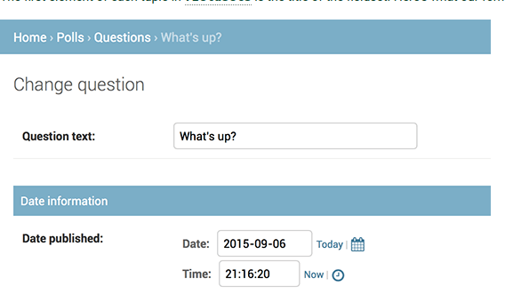
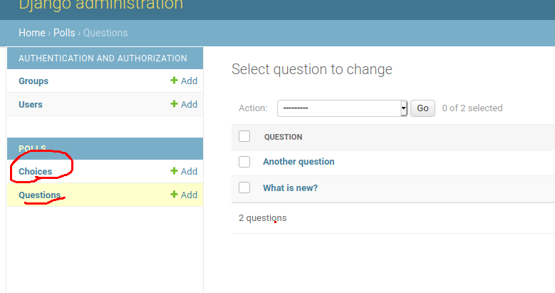
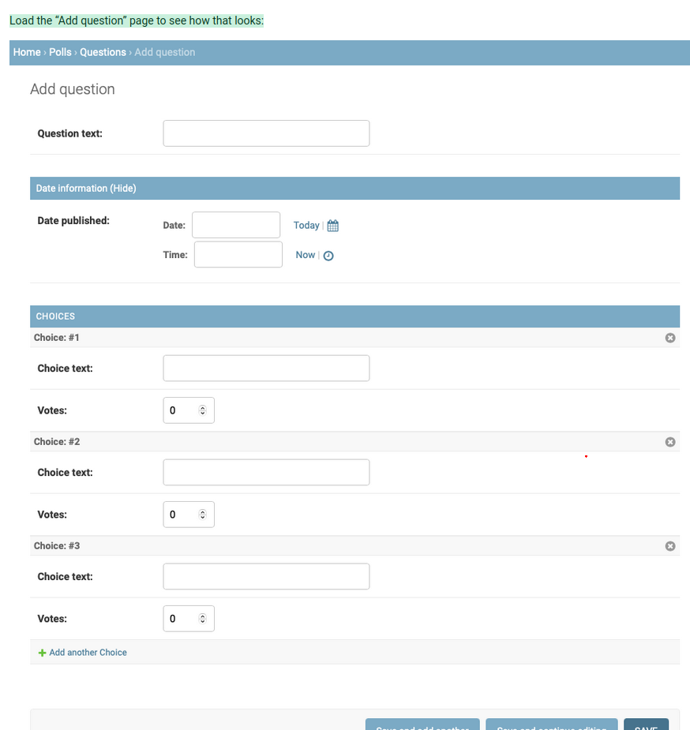
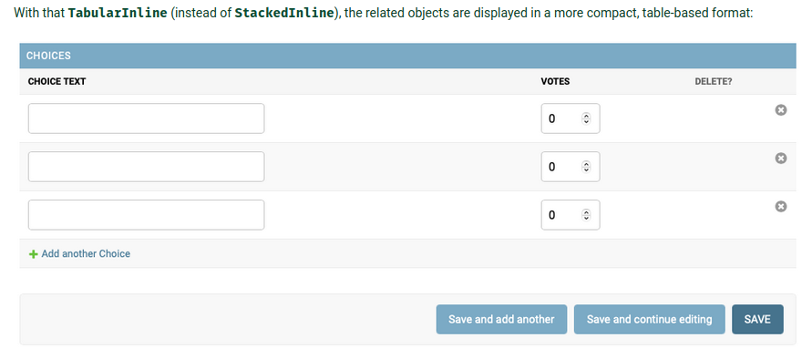

# Django Beginner Project
### Versions
Currently: env webdev, python 3.9.1, django 3.1.4

## Starting a project - Tut


To start a project, `cd` into the relevant directory, where the project folder is going to be located:
Run subsequently

```bash
>>> django-admin startproject proj1
```

### Where to store the code 
in `PHP`, code is stored under the web servers root: `/var/www`.
This is not done in django. None of the python code should  be within the web server's root, because people may be able to view the code. 
The documentation states to place the code somewehere else, such as `/home/mycode`... however, it is unclear if this falls in the project folder?

### Contens of the genereated project
```
mysite/
    manage.py
    mysite/
        __init__.py
        settings.py
        urls.py
        asgi.py
        wsgi.py
```
These files are:

* The outer mysite/ root directory is a container for your project. Its name doesn’t matter to Django; you can rename it to anything you like.

* manage.py: A command-line utility that lets you interact with this Django project in various ways. You can read all the details about manage.py in django-admin and manage.py.

* The inner mysite/ directory is the actual Python package for your project. Its name is the Python package name you’ll need to use to import anything inside it (e.g. mysite.urls).

* mysite/__init__.py: An empty file that tells Python that this directory should be considered a Python package. If you’re a Python beginner, read more about packages in the official Python docs.

* mysite/settings.py: Settings/configuration for this Django project. Django settings will tell you all about how settings work.

* mysite/urls.py: The URL declarations for this Django project; a “table of contents” of your Django-powered site. You can read more about URLs in URL dispatcher.

* mysite/asgi.py: An entry-point for ASGI-compatible web servers to serve your project. See How to deploy with ASGI for more details.

* mysite/wsgi.py: An entry-point for WSGI-compatible web servers to serve your project. See How to deploy with WSGI for more details

### Test run the generated project
`cd` to the directory where `manage.py` is located. Run the file with python, passing the `runserver` as an argument:

```bash
>>> python manage.py runserver
```

### Migrations
Seemingly there may be the following warning message:

```bash
You have 18 unapplied migration(s). Your project may not work properly until you apply the migrations for app(s): admin, auth, contenttypes, sessions.
Run 'python manage.py migrate' to apply them.
```

### Minor note on the light-weight server and apache
Django ships with a light-weight server option, relieving us from the need of implementing it in `Apache`. instead we can wait until production time before shipping it with apache. 


### Changing port and IP


Changing the port

By default, the runserver command starts the development server on the internal IP at port 8000.

If you want to change the server’s port, pass it as a command-line argument. For instance, this command starts the server on port 8080:


$ python manage.py runserver 8080

If you want to change the server’s IP, pass it along with the port. For example, to listen on all available public IPs (which is useful if you are running Vagrant or want to show off your work on other computers on the network), use:


$ python manage.py runserver 0:8000

0 is a shortcut for 0.0.0.0. Full docs for the development server can be found in the runserver reference.

### Restarting the server and refreshing code

***Note***: The development server automatically reloads Python code for each request as needed. You don’t need to restart the server for code changes to take effect. However, some actions like adding files don’t trigger a restart, so you’ll have to restart the server in these cases.

### Projects vs apps

What’s the difference between a project and an app? An app is a Web application that does something – e.g., a Weblog system, a database of public records or a small poll app. A project is a collection of configuration and apps for a particular website. A project can contain multiple apps. An app can be in multiple projects.

### apps location
apps can live anywhere in the `Python path` (i.e. the path that is searched for when running `>>> python` in the terminal). 

### Create an app
In the same directory as `manage.py`, run `python manage.py startapp polls`, which generates

```bash
polls/
    __init__.py
    admin.py
    apps.py
    migrations/
        __init__.py
    models.py
    tests.py
    views.py
```

This directory structure will house the poll application.

## The Polls App - tut
### Writing first view
open `polls/views.py`. Insert:

```python
from django.http import HttpRequest

def index(requst):
    return HttpResponse("hello world...")
```

This is the simplest view possible in Django. To call the view, we need to map it to a URL - and for this we need a URLconf.

To create a URLconf in the polls directory, create a file called urls.py. Your app directory should now look like:

```
polls/
    __init__.py
    admin.py
    apps.py
    migrations/
        __init__.py
    models.py
    tests.py
    urls.py
    views.py
```

In the `polls/urls.py` include the following code. 
```python
from django-urls import paths
from . import views # accessing the `views.py` file that we modded above, and the `index` method

urlpatterns = [
    path("", views.index, name="index")
]
```
The next step is to point the root URLconf at the polls.urls module. When referring to the ***root*** URLconf, we are referring to `mysite`! 
In mysite/urls.py, add an import for django.urls.include and insert an include() in the urlpatterns list, so you have: 

`mysite/urls.py`
```python
from django.contrib import admin # unclear what admin does
from django.urls import include, path

urlpatterns = [
    path("polls/", include("polls.urls")), # this may be referring to the `urls.py` file in `polls` folder...
    path("admin/", admin.site.urls),
]
```
The `include()` function allows referencing other URLconfs. 

Whenever Django encounters `include()`, it ***chops off whatever part of the URL matched up to that point and sends the remaining string to the included URLconf for further processing***.

Alltså, om vi då har i `mysite/mysite/urls.py` följande:
```python
from django.contrib import admin
from django.urls import include, path

urlpatterns = [
    path("polls/", include("polls.urls")),
    path("admin/", admin.site.urls),
]
```
sen följande i `mysite/polls/urls.py`
```python
from django.urls import path
from . import views

urlpatterns = [
    path("pp", views.index, name="index"),
]
```
Då när vi access: `http://127.0.0.1:8000/polls/pp` kommer vi få svaret. Notera `pp` i slutet, som vi adderade i den `include()` pathen! Alltså moddade vi the `urlpatterns`

The idea behind `include()` is to make it easy to plug-and-play URLs. Since polls are in their own URLconf (polls/urls.py), 

they can be placed under “/polls/”, or under “/fun_polls/”, or under “/content/polls/”, or any other path root, and the app will still work.

### when to use include()

You should always use `include()` when you include other URL patterns. `admin.site.urls` is the only exception to this.

### verify the index view
You have now wired an index view into the URLconf. Verify it’s working with `...\> py manage.py runserver`

## Database setup
Open `mysite/settings.py`. its a normal `module` (that can be imported yani), with module-level variables representing django settings.

### By default
By default, it is configred to use SQLite, which is the easiest choice. SQLite is included in python, no need to install anything. 

### Changing database
instead of the default database, it is possible to use different ones. 

to do this, install the appropriate `database bindings` and change the following keys in the `mysite/settings.py` file: `DATABASES` `'default'` item and match your database connection settings: 
* `ENGINE`: either `django.db.backends.sqlite3`, `django.db.backends.postgresql`, `django.db.backends.mysql`, or `django.db.backends.oracle`. More are also available
* `NAME`: the name of your database. if `SQLite`, the databse will be a file on our computer. in this case, `NAME` should be the full absoltue path, including filename, of that file. 
    * the default `BASE_DIR / 'db.sqlite3'` will store the file in our project directory. 

###  For databases other than SQLite

If you’re using a database besides SQLite, make sure you’ve created a database by this point. Do that with “CREATE DATABASE database_name;” within your database’s interactive prompt.

Also make sure that the database user provided in mysite/settings.py has “create database” privileges. This allows automatic creation of a test database which will be needed in a later tutorial.

If you’re using SQLite, you don’t need to create anything beforehand - the database file will be created automatically when it is needed.


#### In not SQLite
if you are not using SQLite as your database, additional settings such as USER, PASSWORD, and HOST must be added. For more details, see the reference documentation for DATABASES.


### INSTALLED APPS
Also, note in `mytesite/settings.py` the `INSTALLED_APPS` setting at the top of the file. That holds the names of all Django applications that are activated in this Django instance. Apps can be used in multiple projects, and you can package and distribute them for use by others in their projects.

* `django.contrib.admin` – The admin site. You’ll use it shortly.
* `django.contrib.auth` – An authentication system.
* `django.contrib.contenttypes` – A framework for content types.
* `django.contrib.sessions` – A session framework.
* `django.contrib.messages` – A messaging framework.
* `django.contrib.staticfiles` – A framework for managing static files.

#### Database tables
Some of these installed apps use at least one `database table`. So we need to create the tables in the database, before we can use them. 

To build the `database tables`:

```bash
>>> python manage.py migrate
```
#### migrate command
the `migrate` command through `manage.py`, looks at `INSTALLED_APPS` settinsg and creates any necessary datbase tables, in accord to the databse settings in `mysite/settings.py`

##### Running command-line database client
To start the command-line database client, in the terminal/cmd run `sqlite3`. Note that the command will depend on the databse that we are runnnig and the client that the database ships with, so it may be different than `sqlite3`.  

NOTE: `SQL` has line-terminators with `;`, in order to run the code. 

If you’re interested, run the command-line client for your database and type \dt (PostgreSQL), SHOW TABLES; (MariaDB, MySQL), .schema (SQLite), or SELECT TABLE_NAME FROM USER_TABLES; (Oracle) to display the tables Django created.

We ran SQLite. 

### Creating models
Now we will define our models, the database layout with more metadata. 

#### What a model is
* The model = single definitive source of truth *about* our data 
* It contains the essential dields and behaviors of the data your storing. 
* ***DRY principle*** is being used
* goal = to define our data model in one place, and automatically *derive* things from it. 
* Includes migrations, unlike Ruby on rails, migrations are entirely derived from the our models file. and are essentially a hitory that django can roll thry to update our databse schema to match our current models.

#### In our poll app
we wish to create two models: Question and a choice. 
* Question has question and publication data
* choice has two fields, the text of the choice, and the vote tally. 
* each choice is associated with a question

These concept are represented by Python classes.

edit `polls/models.py`:

```python
from django.db import models

class Question(models.Model):
    question_text = models.Charfield(max_length=200)
    pub_date = models.DateTimeField("Date published")

class Choice(models.Model):
    question = models.ForeignKey(Question, on_delete=models.CASCADE)
    choice_text = models.CharField(max_length=200)
    votes = models.IntegerField(default=0)
```

* Each model here (Question and Choice) are rerpesenterd by a class that *subclasses* `django.db.models.Model`. 
* There are a number of class variables in each model (e.g. `question_text`), which represent ***database field in the model***. 
* Each field represented by *an instance* to a `Field` class. e.g. `CharField` and `IntegerField`. This tells django what type of data is contained in each field. 
* the `field names`, e.g. `question_text` will be is the names we will use when we refer to the fields, and will be the `columns` in the database. 
* Finally, note a relationship is defined, using ForeignKey. That tells Django each Choice is related to a single Question. Django supports all the common database relationships: many-to-one, many-to-many, and one-to-one

#### Activating models
Small bit of code in models, gives Django a lot of info. With it, django will:
* create a databse schema (`CREATE TABLE` statements) for the app
* create a Python databse-access API för accessing `Question` and `Choice` objects. 

### Install our Polls app
Because apps in django can be used in multiple projects, we need to tell our current project to install the app we have created. 
* Add a reference to the `polls` configuration class, in the `INSTALLED_APPS` setting. 
* `PollsConfig` class is located in the `polls/apps.py`
    * the path is therefore `polls.apps.PollsConfig`

edit `mysite/settings.py` and add the dotted path (dotted path = the import path) to `INSTALLED_APPS` setting. 

```python
INSTALLED_APPS = [
    'polls.apps.PollsConfig', # this was added
    'django.contrib.admin',
    'django.contrib.auth',
    'django.contrib.contenttypes',
    'django.contrib.sessions',
    'django.contrib.messages',
    'django.contrib.staticfiles',
]
```

Django now *knows* to run *include* polls app. Run the following;

```bash
> python manage.py makemaigrations polls

Migrations for 'polls':
  polls/migrations/0001_initial.py
    - Create model Question
    - Create model Choice
```
##### makemigrations
`makemigrations` tells django that we have made changes to our models or made new ones in our case, to be 'stored as migrations'

* "migrations" are how django stores changs to models, thus databse schema.
* They are files on the disk. 

##### Read the migrations
we can read the migrations: `polls/migrations/0001_initial.py`

##### Read the sql generated
There’s a command that will run the migrations for you and manage your database schema automatically - that’s called migrate, and we’ll come to it in a moment - but first, let’s see what SQL that migration would run. The sqlmigrate command takes migration names and returns their SQL:

```bash
>>>>>> python migrate.py sqlmigrate polls 0001

BEGIN;
--
-- Create model Question
--
CREATE TABLE "polls_question" ("id" integer NOT NULL PRIMARY KEY AUTOINCREMENT, "question_text" varchar(200) NOT NULL, "pub_date" datetime NOT NULL);
--
-- Create model Choice
--
CREATE TABLE "polls_choice" ("id" integer NOT NULL PRIMARY KEY AUTOINCREMENT, "choice_text" varchar(200) NOT NULL, "votes" integer NOT NULL, "question_id" integer NOT NULL REFERENCES "polls_question" ("id") DEFERRABLE INITIALLY DEFERRED);
CREATE INDEX "polls_choice_question_id_c5b4b260" ON "polls_choice" ("question_id");
COMMIT;
```

* Table names are automatically generated by combining the name of the app (polls)and the lowercase name of the model – question and choice. (You can override this behavior.)
* Primary keys (IDs) are added automatically. (You can override this, too.)
* By convention, Django appends "_id" to the foreign key field name. (Yes, you can override this, as well.)
* The foreign key relationship is made explicit by a FOREIGN KEY constraint. Don’t worry about the DEFERRABLE parts; it’s telling PostgreSQL to not enforce the foreign key until the end of the transaction.
* It’s tailored to the database you’re using, so database-specific field types such as auto_increment (MySQL), serial (PostgreSQL), or integer primary key autoincrement (SQLite) are handled for you automatically. Same goes for the quoting of field names – e.g., using double quotes or single quotes.
* The sqlmigrate ***command doesn’t actually run the migration*** on your database - instead, it prints it to the screen so that you can see what SQL Django thinks is required. It’s useful for checking what Django is going to do or if you have database administrators who require SQL scripts for changes.

##### check for problems migrations
If you’re interested, you can also run python manage.py check; this checks for any problems in your project without making migrations or touching the database.

#### Run migrate again
Now, run migrate again to create those model tables in your database:

```bash
>>> python manage.py migrate

Operations to perform:
  Apply all migrations: admin, auth, contenttypes, polls, sessions
Running migrations:
  Applying polls.0001_initial... OK
```


#### Three-step guide for models changes
1. Chnage your models in `models.py`
2. run `python manage.py makemigrations` to create migrations for those changes
3. run `python manage.py migrate` to apply those changes to the database

## Playing with the database API

There is an interactive django API we can use. To invoke the shell use: 

To invoke the shell: 
`>>> python manage.py shell`

We are doing this, instead of simply tuping `python`. `manage.py` sets the `DJANGO_SETTINGS_MODULE` env variable, giving Django the python import path to `mysite/settings.py`. 

#### Exploring the database API
Once in the shell, we explore `database API`
```python
>>> from polls.models import Choice, Question  # Import the model classes we just wrote.

# No questions are in the system yet.
>>> Question.objects.all()
<QuerySet []>

# Create a new Question.
# Support for time zones is enabled in the default settings file, so
# Django expects a datetime with tzinfo for pub_date. Use timezone.now()
# instead of datetime.datetime.now() and it will do the right thing.
>>> from django.utils import timezone
>>> q = Question(question_text="What's new?", pub_date=timezone.now())

# Save the object into the database. You have to call save() explicitly.
>>> q.save()

# Now it has an ID.
>>> q.id
1

# Access model field values via Python attributes.
>>> q.question_text
"What's new?"
>>> q.pub_date
datetime.datetime(2012, 2, 26, 13, 0, 0, 775217, tzinfo=<UTC>)

# Change values by changing the attributes, then calling save().
>>> q.question_text = "What's up?"
>>> q.save()

# objects.all() displays all the questions in the database.
>>> Question.objects.all()
<QuerySet [<Question: Question object (1)>]>
```

Wait a minute. `<Question: Question object (1)>` isn’t a helpful representation of this object. Let’s fix that by editing the Question model (in the polls/models.py file) and adding a __str__() method to both Question and Choice:

##### adding __str__()
So this is nice, that we do not like the direct representation when we write `polls.models.Question` in the shell, that we wish to modify the output: 

in `polls/models.py`

```python
from django.db import models

class Question(models.Model):
    ...

    def __str__(self):
        return self.question_text

class Choice(models.Model):
    ...

    def __str__(self):
        return self.choice_text
```
I.e. we wish when we call the `polls.models.Choice` or `Question` objects, that the fields we have input will be returned

It’s important to add __str__() methods to your models, not only for your own convenience when dealing with the interactive prompt, but also because objects’ representations are used throughout Django’s automatically-generated admin.

##### adding custom method to model
in `polls/models.py`

```python
import datetime
from django.db import models
from django.utils import timezone

class Question(models.Model):
    # ...
    def was_published_recently(self):
        return self.pub_date >= timezone.now() - datetime.timedelta(days=1)
```

Save these changes (we do not need to run `python manage.py migrate`, just save the code to the file) and start a new Python interactive shell by running `python manage.py shell` again:
```python
>>> from polls.models import Choice, Question

# Make sure our __str__() addition worked.
>>> Question.objects.all()
<QuerySet [<Question: What's up?>]>

# Django provides a rich database lookup API that's entirely driven by
# keyword arguments.
>>> Question.objects.filter(id=1)
<QuerySet [<Question: What's up?>]>
           
>>> Question.objects.filter(question_text__startswith='What')
<QuerySet [<Question: What's up?>]>

# Get the question that was published this year.
>>> from django.utils import timezone
>>> current_year = timezone.now().year
>>> Question.objects.get(pub_date__year=current_year)
<Question: What's up?>

# Request an ID that doesn't exist, this will raise an exception.
>>> Question.objects.get(id=2)
Traceback (most recent call last):
    ...
DoesNotExist: Question matching query does not exist.

# Lookup by a primary key is the most common case, so Django provides a
# shortcut for primary-key exact lookups.
# The following is identical to Question.objects.get(id=1).
>>> Question.objects.get(pk=1)
<Question: What's up?>

# Make sure our custom method worked.
>>> q = Question.objects.get(pk=1)
>>> q.was_published_recently()
True
```

```python
# Give the Question a couple of Choices. The create call constructs a new
# Choice object, does the INSERT statement, adds the choice to the set
# of available choices and returns the new Choice object. Django creates
# a set to hold the "other side" of a ForeignKey relation
# (e.g. a question's choice) which can be accessed via the API.
>>> q = Question.objects.get(pk=1)

# Display any choices from the related object set -- none so far.
>>> q.choice_set.all()
<QuerySet []>

# Create three choices.
>>> q.choice_set.create(choice_text='Not much', votes=0)
<Choice: Not much>

>>> q.choice_set.create(choice_text='The sky', votes=0)
<Choice: The sky>

>>> c = q.choice_set.create(choice_text='Just hacking again', votes=0)

# Choice objects have API access to their related Question objects.
>>> c.question
<Question: What's up?>

# And vice versa: Question objects get access to Choice objects.
>>> q.choice_set.all()
<QuerySet [<Choice: Not much>, <Choice: The sky>, <Choice: Just hacking again>]>
>>> q.choice_set.count()
3
```

###### Deleting one of the choices
```python
# The API automatically follows relationships as far as you need.
# Use double underscores to separate relationships.
# This works as many levels deep as you want; there's no limit.
# Find all Choices for any question whose pub_date is in this year
# (reusing the 'current_year' variable we created above).
>>> Choice.objects.filter(question__pub_date__year=current_year)
<QuerySet [<Choice: Not much>, <Choice: The sky>, <Choice: Just hacking again>]>

# Let's delete one of the choices. Use delete() for that.
>>> c = q.choice_set.filter(choice_text__startswith='Just hacking')
>>> c.delete()
```

###### General
Check down below why `choice_set` specifically is used, it related to the Django backtracing ORM, that automatically generates the fields when using `ForeignKey`. 

### The Django admin
Generating admin sites for your staff or clients to add, change, and delete content is tedious work that doesn’t require much creativity. For that reason, Django entirely automates creation of admin interfaces for models.

Django was written in a newsroom environment, with a very clear separation between “content publishers” and the “public” site. 

Site managers use the system to add news stories, events, sports scores, etc., and that content is displayed on the public site. 

Django solves the problem of creating a unified interface for site administrators to edit content.

The admin isn’t intended to be used by site visitors. It’s for site managers.

#### Creating an admin user

Need a user who can login to the admin site: Run the following:
```
>>> python manage.py createsuperuser
username: admin
email address: admin@example.com
Password: *******
Password (again): ******
Superuser created successfully
```

#### Start the (development) server
Let us run the server now:
`python manage.py runserver`

and go to the admin page `http://127.0.0.1:8000/admin/`
and sign in. 

#### Inside the admin page
We are presented by "editable content": `groups` and `users`. These are provided by `django.contrib.auth`

#### Make the poll app modifiable in the admin
The poll app is not displayed seemingly on the admin index page. 
we need to tell the admin that Question objects have an admin interface. To do this, open the `polls/admin.py` file, and edit it to look like this:

```python
from django.contrib import admin

from .models import Question

admin.site.register(Question)
```

Save it to file, and just reload the admin page, and we will se it on the admin index page! 

##### The Questions page

Enter the Questions page

The form is automatically generated from the Question model.
The different model field types (DateTimeField, CharField) correspond to the appropriate HTML input widget. Each type of field knows how to display itself in the Django admin.

Each DateTimeField gets free JavaScript shortcuts. Dates get a “Today” shortcut and calendar popup, and times get a “Now” shortcut and a convenient popup that lists commonly entered times.


### Views
* In Django, web pages and other content are delivered by views. Each view is represented by a Python function (or method, in the case of class-based views). 
* Django will choose a view by examining the URL that’s requested (to be precise, the part of the URL after the domain name)

#### URLconfs
A URL pattern is the general form of a URL - for example: /newsarchive/<year>/<month>/.

To get from a URL to a view, Django uses what are known as ‘URLconfs’. A URLconf maps URL patterns to views.

#### writing more views

`polls/views.py`

```python
def detail(request, qustion_id):
    return HttpResponse(f"You're looking at question {question_id}.")

def results(request, question_id):
    response = f"You're looking at the results of question {question_id}."
    return HttpResponse(response)

def vote(request, question_id):
    return HttpResponse(f"You're  voting on question {question_id}.")
```

Note that we are using the variable `question_id`

```python
from django.urls import path
from . import views

urlpatterns = [
    path("pp", views.index, name="index"),
    path("<int:question_id>/", views.detail, name="detail"),
    path("<int:question_id>/results/>", views.results, name="results"),
    path("<int:question_id>/vote/", views.vote, name="vote")
]
```

om vi därför matar in `http://127.0.0.1:8000/polls/100/` så får vi `print`: 
"You're looking at question 100."

When somebody requests a page from your website – say, “/polls/34/”: 
* Django will load the mysite.urls Python module because it’s pointed to by the ROOT_URLCONF setting. 
* It finds the variable named urlpatterns and traverses the patterns in order. 
* After finding the match at 'polls/', it strips off the matching text ("polls/") and sends the remaining text – "34/" – to the ‘polls.urls’ URLconf for further processing. 
* There it matches '<int:question_id>/', resulting in a call to the detail() view like so: `detail(request=<HttpRequest object>, question_id=34)`

#### Writing views that do stuff
Each view is responsible for doing one of two things: returning an `HttpResponse` object containing the content for the requested page, or raising an exception such as `Http404`. The rest is up to you

Your view can read records from a database, or not. It can use a template system such as Django’s – or a third-party Python template system – or not. It can generate a PDF file, output XML, create a ZIP file on the fly, anything you want, using whatever Python libraries you want.

All Django wants is that `HttpResponse`. Or an exception.


Let’s use Django’s own database API, which we covered in Tutorial 2. Here’s one stab at a new `index()` view, which displays the latest 5 poll questions in the system, separated by commas, according to publication date:


`polls/views.py`
```python
from django.http import HttpResponse

from .models import Question


def index(request):
    latest_question_list = Question.objects.order_by('-pub_date')[:5]
    output = ', '.join([q.question_text for q in latest_question_list])
    return HttpResponse(output)

# Leave the rest of the views (detail, results, vote) unchanged
```
There’s a problem here, though: the page’s design is hard-coded in the view. If you want to change the way the page looks, you’ll have to edit this Python code. So let’s use Django’s template system to separate the design from Python by creating a template that the view can use.

In `$ python manage.py shell`, one can add more question objects:
```python
> from django.utils import timezone
> from polls.models import Question, Choice
>
> random_q = Question(question_text="random text", pub_date=timezone.now())
> random_q.save()
```

#### Templates - `polls/templates`

First, create a directory called templates in your polls directory. Django will look for templates in there.

Your project's `TEMPLATES` setting describe how Django will load and render templates. The default settings file configures a `DjangoTemplates` backend, whose `APP_DIRS` options is set to `True`. By convention, `DjangoTemplates` looks for a "templates" subdirectory in each of the `INSTALLED_APPS`.

In the `polls/templates` folder, create another folder called `polls`, within which an `index.html`. Thus `polls/templates/polls/index.html`. 

Due to how the `app_directories` template loader works, as described above... you can refer to this template within django as `polls/index.html`!


##### Template namespacing

Now we might be able to get away with putting our templates directly in polls/templates (rather than creating another polls subdirectory), but it would actually be a bad idea. Django will choose the first template it finds whose name matches, and if you had a template with the same name in a different application, Django would be unable to distinguish between them. We need to be able to point Django at the right one, and the best way to ensure this is by namespacing them. That is, by putting those templates inside another directory named for the application itself.


##### Creating template index.html
in `polls/templates/polls/index.html`
```python

    <ul>
        
            <li>
                <a href="/polls/{{ question.id }}/">
                    {{ question.question_text }}
                </a>
            </li>
        
        </ul>

        <p>No polls are available</p>

```

##### Updating the index view with template
Now let’s update our index view in `polls/views.py` to use the template:
```python
from django.http import HttpResponse
from django.template import loader

from .models import Question

def index(request):
    latest_question_list = Question.objects.order_by("-pub_date")[:5]

    # This is the important part, as it will allow us
    # to bring in the template we created
    template = loader.get_template("polls/index.html")

    context = {
        "latest_question_list": latest_question_list,        
    }

    return HttpResponse(template.render(context, request))
```
Via `django.template.loader("polls/index.html")` we will be able to laod the template, and pass it a context. 

***The context is a dictionary which maps variable-names to Python objects***

Load the page by pointing yout browser at `/polls/`. 

#### A shortcut: render()

It’s common to load a template, fill a context and return an HttpResponse object with the rendered template. Django provides a shortcut. 

Here’s the full `index()` view, rewritten:
`polls/views.py`
```python
from django.shortcuts import render

from .models import Question'

def index(request):
    latest_question_list = Question.objects.order_by("-pub_date")[:5]
    context = { "latest_question_list": latest_question_list }
    return render(request, "polls/index.html", context)
```


Note that once we’ve done this in all these views, we no longer need to import loader and HttpResponse (you’ll want to keep `HttpResponse` if you still have the stub methods for `detail`, `result`, `vote`).


#### Raising a 404 error

Now, lets tackle the "question detail view". The page that displays the qeston text for a given poll. 

Here's the view
`polls/views.py`

```python
from django.http import Http404
from django.shortcuts import render

from .models import Question

# ... all the rest

def detail(request, question_id):
    try:
        question = Question.objects.get(pk=question_id)
    except Question.DoesNotExist:
        # This is where the 404 error occurs, it will exist the 
        # method
        raise Http404("Question does not exist")
    return render(request, 'polls/detail.html', {'question': question})
```

We’ll discuss what you could put in that polls/detail.html template a bit later, but if you’d like to quickly get the above example working, a file containing just:

`polls/templates/polls/detail.html`
```html
{{ question }}
```


#### Shortcut for get_object_or_404()
It's very common to use `get()` and raise `Http404`, if the object doesnt exist. Django provides a shortcut. here's detail view, rewritten:

`polls/views.py`

```python
from django.shortcuts import get_object_or_404, render

from .models import Question

# [...]

def detail(request, question_id):
    question = get_object_or_404(Question, pk=question_id)
    context = {"question": question}
    return render(request, "polls/detail.html", context)
```

The get_object_or_404() function takes a Django model as its first argument and an arbitrary number of keyword arguments, which it passes to the `get()` function of the ***model’s manager*** (i.e. the `Question` class model we). It raises Http404 if the object doesn’t exist.

There’s also a get_list_or_404() function, which works just as get_object_or_404() – except using filter() instead of get(). It raises Http404 if the list is empty.


### Use the Template System

Back to the `detail()` view for our poll application. Given the `context` variable `question`, here's what the `polls/detail.html` could look like:

`polls/template/polls/detail.html`

```html
<h1>{{ question.question_text }}</h1>
<ul>

    <li>{{ choice.choice_text }}</li>

</ul>
```
#### dot-lookup syntax in templates

The template system uses dot-lookup syntax to access variable attributes. In the example of `{{ question.question_text }}`, first Django does a dictionary lookup on the object `question`. Failing that, it tries an attribute lookup – which works, in this case. If attribute lookup had failed, it would’ve tried a list-index lookup.

#### Method calling in templates
***Method-calling*** happens in the ` loop: question.choice_set.all` is interpreted as the `question.choice_set.all()` (in Python code ya3ni, note the `all()` method), which returns an iterable of `Choice` objects and is suitable for use in the `` tag.

See the https://docs.djangoproject.com/en/3.1/topics/templates/ guide for more about templates.


### Removing harcode URLs in templates

Recall when we wrote the link to a `question` in `polls/index.html`, the link was harcoded as:
`<li><a href="/polls/{{ question.id }}/">{{question.question_text}}</a></li>`

The problem with this hardcoded, tightly-coupled approach is that it becomes challenging to change URLs on projects with a lot of templates. 

However, since you defined the `name` argument in the `path()` functions in the `polls.urls` module, you can ***remove a reliance on specific URL paths*** defined in your url configurations by using the `` template tag:

`<li><a href="">{{ question.question_text }}</a></li>`


The way this works is by looking up the URL definition as specified in the polls.urls module. 

You can see exactly where the URL name of ‘detail’ is defined below:
```python
# ...
# the 'name' value as called by the  template tag
path('<int:question_id>/', views.detail, name='detail'),
# ...
```


### Namespacing URL names

* The tutorial project has just one app, polls. In real Django projects, there might be five, ten, twenty apps or more. How does Django differentiate the URL names between them? 
* For example, the polls app has a `detail` view, and so might an app on the same project that is for a blog. 
* How does one make it so that Django knows which app view to create for a url when using the `` template tag?
* The answer is to add `namespaces` to your URLconf. 
* In the `polls/urls.py` file, go ahead and add an `app_name` to set the application namespace:


Thus, the label before the colon refers to what app we are going to be looking at. 

`polls/urls.py`

```python
from django.urls import path

from . import views

app_name = 'polls' # this is the new part
urlpatterns = [
    path('', views.index, name='index'),
    path('<int:question_id>/', views.detail, name='detail'),
    path('<int:question_id>/results/', views.results, name='results'),
    path('<int:question_id>/vote/', views.vote, name='vote'),
]
```

Now change your `polls/templates/polls/index.html` template from:
```html
<li><a href="">{{ question.question_text }}</a></li>
```

into 

`polls/templates/polls/index.html`

```html
<li><a href="">{{ question.question_text }}</a></li>
```

## Write a minimal form

Let us update our `polls/templates/polls/detail.html`:

```html
<h1>{{ question.question_text }}</h1>

<p><strong>{{ error_message }}</strong></p>
<form action="" method="post">
    
    
    <input type="radio" name="choice" id="choice{{ forloop.counter }}" value="{{choice.id}}">
    <label for="choice{{ forloop.counter }}">{{ choice.choice_text }}</label><br>
    
    <input type="submit" value="Vote">
</form>
```

* The above template displays a radio button for each question choice. The `value` of each radio button is the associated question choice’s ID. The `name` of each radio button is `"choice"`. That means, when somebody selects one of the radio buttons and submits the form, it’ll send the POST data `choice=#` where # is the ID of the selected choice. This is the basic concept of HTML forms.
* We set the form’s `action` to ``, and we set `method="post"`. Using `method="post"` (as opposed to `method="get"`) is very important, because the act of submitting this form will alter data server-side. Whenever you create a form that alters data server-side, use `method="post"`. This tip isn’t specific to Django; it’s good Web development practice in general.
* `forloop.counter` indicates how many times the [`for`](https://docs.djangoproject.com/en/3.1/ref/templates/builtins/#std:templatetag-for) tag has gone through its loop
* Since we’re creating a POST form (which can have the effect of modifying data), we need to worry about Cross Site Request Forgeries. Thankfully, you don’t have to worry too hard, because Django comes with a helpful system for protecting against it. In short, all POST forms that are targeted at internal URLs should use the [``](https://docs.djangoproject.com/en/3.1/ref/templates/builtins/#std:templatetag-csrf_token) template tag


#### Changing views


`polls/templates/polls/views.py`

```python
from django.http import HttpResponse, HttpResponseRedirect
from django.shortcuts import get_object_or_404, render
from django.urls import reverse

from .models import Choice, Question
# ...
def vote(request, question_id):
    question = get_object_or_404(Question, pk=question_id)
    try:
        selected_choice = question.choice_set.get(pk=request.POST['choice'])
        
    except (KeyError, Choice.DoesNotExist):
        # Redisplay the question voting form.
        return render(request, 'polls/detail.html', {
            'question': question,
            'error_message': "You didn't select a choice.",
        })
    else:
        selected_choice.votes += 1
        selected_choice.save()
        # Always return an HttpResponseRedirect after successfully dealing
        # with POST data. This prevents data from being posted twice if a
        # user hits the Back button.
        return HttpResponseRedirect(reverse('polls:results', args=(question.id,)))
```


This code includes a few things we haven’t covered yet in this tutorial:

- [`request.POST`](https://docs.djangoproject.com/en/3.1/ref/request-response/#django.http.HttpRequest.POST) is a dictionary-like object that lets you access submitted data by key name. In this case, `request.POST['choice']` returns the ID of the selected choice, as a string.

- [`request.POST`](https://docs.djangoproject.com/en/3.1/ref/request-response/#django.http.HttpRequest.POST) values are always strings.

- Note that Django also provides [`request.GET`](https://docs.djangoproject.com/en/3.1/ref/request-response/#django.http.HttpRequest.GET) for accessing GET data in the same way – but we’re explicitly using [`request.POST`](https://docs.djangoproject.com/en/3.1/ref/request-response/#django.http.HttpRequest.POST) in our code, to ensure that data is only altered via a POST call.

- `request.POST['choice']` will raise [`KeyError`](https://docs.python.org/3/library/exceptions.html#KeyError) if `choice` wasn’t provided in POST data. The above code checks for [`KeyError`](https://docs.python.org/3/library/exceptions.html#KeyError) and redisplays the question form with an error message if `choice` isn’t given.

- After incrementing the choice count, the code returns an [`HttpResponseRedirect`](https://docs.djangoproject.com/en/3.1/ref/request-response/#django.http.HttpResponseRedirect) rather than a normal [`HttpResponse`](https://docs.djangoproject.com/en/3.1/ref/request-response/#django.http.HttpResponse). [`HttpResponseRedirect`](https://docs.djangoproject.com/en/3.1/ref/request-response/#django.http.HttpResponseRedirect) takes a single argument: the URL to which the user will be redirected (see the following point for how we construct the URL in this case).

  As the Python comment above points out, you should always return an [`HttpResponseRedirect`](https://docs.djangoproject.com/en/3.1/ref/request-response/#django.http.HttpResponseRedirect) after successfully dealing with POST data. This tip isn’t specific to Django; it’s good Web development practice in general.

- We are using the [`reverse()`](https://docs.djangoproject.com/en/3.1/ref/urlresolvers/#django.urls.reverse) function in the [`HttpResponseRedirect`](https://docs.djangoproject.com/en/3.1/ref/request-response/#django.http.HttpResponseRedirect) constructor in this example. 

  - This function helps avoid having to hardcode a URL in the view function. 
  - It is given the name of the view that we want to pass control to and the variable portion of the URL pattern that points to that view. 
  - In this case, using the URLconf we set up in [Tutorial 3](https://docs.djangoproject.com/en/3.1/intro/tutorial03/), this [`reverse()`](https://docs.djangoproject.com/en/3.1/ref/urlresolvers/#django.urls.reverse) call will return a string like `/polls/3/results` Where the 3 is the value of `question.id`.  
  - This redirected URL will then call the `results` view to display the final page. 

As mentioned in Tutorial 3, `request` is an `HttpRequest` object. For more on `HttpRequest` objects, see the `request and response documentation`. 

`/polls/3/result`

where 3 is the value of `question.id`. This redirected URL will then call the `results` view to display the final page.


#### Writing the results page

After somebody votes in a question, the `vote()` view redirects to the results page for the question. Let’s write that view:

`polls/views.py`

```python
from django.shortcuts import get_object_or_404, render

def results(request, question_id):
    question = get_object_or_404(Question, pk=question_id)
    return render(request, "polls/request.html", {"question": question})
```


Let us write the `results` template:

`polls/templates/polls/results.html`

```html
<h1>{{ question.question_text }}</h1>

<ul>

    <li>{{ choice.choice_text }} -- {{ choice.votes }} vote{{ choice.votes|pluralize }}</li>

</ul>

<a href="">Vote again?</a>
```

### Using Generic Views

The `detail()` (from [Tutorial 3](https://docs.djangoproject.com/en/3.1/intro/tutorial03/)) and `results()` views are very short – and, as mentioned above, redundant. The `index()` view, which displays a list of polls, is similar.

These views represent a common case of basic Web development: getting data from the database according to a parameter passed in the URL, loading a template and returning the rendered template. Because this is so common, Django provides a shortcut, called the “generic views” system.


Generic views abstract common patterns to the point where you don’t even need to write Python code to write an app.

Let’s convert our poll app to use the generic views system, so we can delete a bunch of our own code. We’ll have to take a few steps to make the conversion. We will:

1. Convert the URLconf.
2. Delete some of the old, unneeded views.
3. Introduce new views based on Django’s generic views.


#### Amend URLconf

`polls/urls.py`

```python
from django.urls import path

from . import views

app_name = 'polls'
urlpatterns = [
    path('', views.IndexView.as_view(), name='index'),
    path('<int:pk>/', views.DetailView.as_view(), name='detail'),
    path('<int:pk>/results/', views.ResultsView.as_view(), name='results'),
    path('<int:question_id>/vote/', views.vote, name='vote'),
]
```

Note that the name of the matched pattern in the path strings of the second and third patterns has changed from `<question_id>` to `<pk>`.


#### Amend views

We are going to remove our old `index`, `detail`, `results` views and use Django's generic views instead. 

`polls/views.py`

```python
from django.http import HttpResponseRedirect
from django.shortcuts import get_object_or_404, render
from django.urls import reverse
from django.views import generic

from .models import Choice, Question


class IndexView(generic.ListView):
    template_name = 'polls/index.html'
    context_object_name = 'latest_question_list'

    def get_queryset(self):
        """Return the last five published questions."""
        return Question.objects.order_by('-pub_date')[:5]


class DetailView(generic.DetailView):
    model = Question
    template_name = 'polls/detail.html'


class ResultsView(generic.DetailView):
    model = Question
    template_name = 'polls/results.html'


def vote(request, question_id):
    ... # same as above, no changes needed.
```


We’re using two generic views here: [`ListView`](https://docs.djangoproject.com/en/3.1/ref/class-based-views/generic-display/#django.views.generic.list.ListView) and [`DetailView`](https://docs.djangoproject.com/en/3.1/ref/class-based-views/generic-display/#django.views.generic.detail.DetailView). Respectively, those two views abstract the concepts of:

*  “display a list of objects” and 
* “display a detail page for a particular type of object.”

- Each generic view needs to know what model it will be acting upon. This is provided using the `model` *attribute*.
- The [`DetailView`](https://docs.djangoproject.com/en/3.1/ref/class-based-views/generic-display/#django.views.generic.detail.DetailView) generic view expects the primary key value captured from the URL to be called `"pk"`, so we’ve changed `question_id` to `pk` for the generic views.


By default, the [`DetailView`](https://docs.djangoproject.com/en/3.1/ref/class-based-views/generic-display/#django.views.generic.detail.DetailView) generic view uses a template called `<app name>/<model name>_detail.html`. In our case, it would use the template `"polls/question_detail.html"`. The `template_name` attribute is used to tell Django to use a specific template name instead of the autogenerated default template name. We also specify the `template_name` for the `results` list view – this ensures that the results view and the detail view have a different appearance when rendered, even though they’re both a [`DetailView`](https://docs.djangoproject.com/en/3.1/ref/class-based-views/generic-display/#django.views.generic.detail.DetailView) behind the scenes.


Similarly, the [`ListView`](https://docs.djangoproject.com/en/3.1/ref/class-based-views/generic-display/#django.views.generic.list.ListView) generic view uses a default template called `<app name>/<model name>_list.html`; we use `template_name` to tell [`ListView`](https://docs.djangoproject.com/en/3.1/ref/class-based-views/generic-display/#django.views.generic.list.ListView) to use our existing `"polls/index.html"` template.

In previous parts of the tutorial, the templates have been provided with a context that contains the `question` and `latest_question_list` context variables. For `DetailView` the `question` variable is provided automatically – since we’re using a Django model (`Question`), Django is able to determine an appropriate name for the context variable. However, for ListView, the automatically generated context variable is `question_list`. To override this we provide the `context_object_name` attribute, specifying that we want to use `latest_question_list` instead. As an alternative approach, you could change your templates to match the new default context variables – but it’s a lot easier to tell Django to use the variable you want.


Run the server, and use your new polling app based on generic views.

For full details on generic views, see the [generic views documentation](https://docs.djangoproject.com/en/3.1/topics/class-based-views/).


### Introducing automated testing


## Automatic testing

* Tests are routines that check the operation of your code.
* Testing operates at different levels. Some tests might apply to a tiny detail (*does a particular model method return values as expected?*) while others examine the overall operation of the software (*does a sequence of user inputs on the site produce the desired result?*). That’s no different from the kind of testing you did earlier in [Tutorial 2](https://docs.djangoproject.com/en/3.1/intro/tutorial02/), using the [`shell`](https://docs.djangoproject.com/en/3.1/ref/django-admin/#django-admin-shell) to examine the behavior of a method, or running the application and entering data to check how it behaves.
* What’s different in *automated* tests is that the testing work is done for you by the system. You create a set of tests once, and then as you make changes to your app, you can check that your code still works as you originally intended, without having to perform time consuming manual testing.


### Writing the first test

Fortunately, there’s a little bug in the `polls` application for us to fix right away: the `Question.was_published_recently()` method returns `True` if the `Question` was published within the last day (which is correct) but also if the `Question`’s `pub_date` field is in the future (which certainly isn’t).


Confirm the bug by using the [`shell`](https://docs.djangoproject.com/en/3.1/ref/django-admin/#django-admin-shell) to check the method on a question whose date lies in the future:

```python
$ python manage.py shell

>>> import datetime
>>> from django.utils import timezone
>>> from polls.models import Question
>>> # create a Question instance with pub_date 30 days in the future
>>> future_question = Question(pub_date=timezone.now() + datetime.timedelta(days=30))
>>> # was it published recently?
>>> future_question.was_published_recently()
True
```

### Create a test to expose the bug

What we’ve just done in the [`shell`](https://docs.djangoproject.com/en/3.1/ref/django-admin/#django-admin-shell) to test for the problem is exactly what we can do in an automated test, so let’s turn that into an automated test.

A conventional place for an application’s tests is in the application’s `tests.py` file; the testing system will automatically find tests in any file whose name begins with `test`.

Put the following in the `tests.py` file in the `polls` application:


`polls/tests.py`

```python
import datetime
from django.test import TestCase
from django.utils import timezone

from .models import Question

# Create your tests here.

class QuestionModelTests(TestCase):
    def test_was_published_recently_with_future_question(self):
        """
        was_published_recently() returns False for questions
        whose pub_date is in the future
        """

        time = timezone.now() + datetime.timedelta(days=30)
        future_question = Question(pub_date=time)
        self.assertIs(future_question.was_published_recently(), False)
```

Here we have created a [`django.test.TestCase`](https://docs.djangoproject.com/en/3.1/topics/testing/tools/#django.test.TestCase) subclass with a method that creates a `Question` instance with a `pub_date` in the future. We then check the output of `was_published_recently()` - which *ought* to be False.


### Running tests

In the termina, we can  run our test:

```bash
$ python manage.py test polls
```

And we get:

```bash
Creating test database for alias 'default'...
System check identified no issues (0 silenced).
F
======================================================================
FAIL: test_was_published_recently_with_future_question (polls.tests.QuestionModelTests)
----------------------------------------------------------------------
Traceback (most recent call last):
  File "/path/to/mysite/polls/tests.py", line 16, in test_was_published_recently_with_future_question
    self.assertIs(future_question.was_published_recently(), False)
AssertionError: True is not False

----------------------------------------------------------------------
Ran 1 test in 0.001s

FAILED (failures=1)
Destroying test database for alias 'default'...
```

What happened is this:

- `manage.py test polls` looked for tests in the `polls` application
- it found a subclass of the [`django.test.TestCase`](https://docs.djangoproject.com/en/3.1/topics/testing/tools/#django.test.TestCase) class
- it created a special database for the purpose of testing
- it looked for test methods - ones whose names begin with `test`
- in `test_was_published_recently_with_future_question` it created a `Question` instance whose `pub_date` field is 30 days in the future
- … and using the `assertIs()` method, it discovered that its `was_published_recently()` returns `True`, though we wanted it to return `False`

The test informs us which test failed and even the line on which the failure occurred.


### Fixing the bug

We already know what the problem is: `Question.was_published_recently()` should return `False` if its `pub_date` is in the future. Amend the method in `models.py`, so that it will only return `True` if the date is also in the past:

`polls/models.py`

```python
def was_published_recently(self):
    now = timezone.now()
    return now - datetime.timedelta(days=1) <= self.pub_date <= now
```


```bash
Creating test database for alias 'default'...
System check identified no issues (0 silenced).
.
----------------------------------------------------------------------
Ran 1 test in 0.001s

OK
Destroying test database for alias 'default'...
```

After identifying a bug, we wrote a test that exposes it and corrected the bug in the code so our test passes.

Many other things might go wrong with our application in the future, but we can be sure that we won’t inadvertently reintroduce this bug, because running the test will warn us immediately. We can consider this little portion of the application pinned down safely forever.


### More comprehensive tests

While we’re here, we can further pin down the `was_published_recently()` method; in fact, it would be positively embarrassing if in fixing one bug we had introduced another.

Add two more test methods to the same class, to test the behavior of the method more comprehensively:

`polls/tests.py`

```python
def test_was_published_recently_with_old_question(self):
    """
    was_published_recently() returns False for questions whose pub_date
    is older than 1 day.
    """
    time = timezone.now() - datetime.timedelta(days=1, seconds=1)
    old_question = Question(pub_date=time)
    self.assertIs(old_question.was_published_recently(), False)

def test_was_published_recently_with_recent_question(self):
    """
    was_published_recently() returns True for questions whose pub_date
    is within the last day.
    """
    time = timezone.now() - datetime.timedelta(hours=23, minutes=59, seconds=59)
    recent_question = Question(pub_date=time)
    self.assertIs(recent_question.was_published_recently(), True)
```

### Test a view

The polls application is fairly undiscriminating: it will publish any question, including ones whose `pub_date` field lies in the future. We should improve this. Setting a `pub_date` in the future should mean that the Question is published at that moment, but invisible until then.

### Django test client


Django provides a test [`Client`](https://docs.djangoproject.com/en/3.1/topics/testing/tools/#django.test.Client) to simulate a user interacting with the code at the view level.  We can use it in `tests.py` or even in the [`shell`](https://docs.djangoproject.com/en/3.1/ref/django-admin/#django-admin-shell).

We will start again with the [`shell`](https://docs.djangoproject.com/en/3.1/ref/django-admin/#django-admin-shell), where we need to do a couple of things that won’t be necessary in `tests.py`. The first is to set up the test environment in the [`shell`](https://docs.djangoproject.com/en/3.1/ref/django-admin/#django-admin-shell):

```python
$ python manage.py shell

>>> from django.test.utils import setup_test_environment
>>> setup_test_environment()

```

[`setup_test_environment()`](https://docs.djangoproject.com/en/3.1/topics/testing/advanced/#django.test.utils.setup_test_environment) installs a template renderer which will allow us to examine some additional attributes on responses such as `response.context` that otherwise wouldn’t be available. Note that this method *does not* setup a test database, so the following will be run against the existing database and the output may differ slightly depending on what questions you already created. You might get unexpected results if your `TIME_ZONE` in `settings.py` isn’t correct. If you don’t remember setting it earlier, check it before continuing.


Next we need to import the test client class (later in `tests.py` we will use the [`django.test.TestCase`](https://docs.djangoproject.com/en/3.1/topics/testing/tools/#django.test.TestCase) class, which comes with its own client, so this won’t be required):

```python
>>> from django.test import Client
>>> # create an instance of the client for our use
>>> client = Client()

```

with that ready, we can ask the client to do some work for us:

```python
>>> # get a response from '/'
>>> response = client.get('/')
Not Found: /
>>> # we should expect a 404 from that address; if you instead see an
>>> # "Invalid HTTP_HOST header" error and a 400 response, you probably
>>> # omitted the setup_test_environment() call described earlier.
>>> response.status_code
404
>>> # on the other hand we should expect to find something at '/polls/'
>>> # we'll use 'reverse()' rather than a hardcoded URL
>>> from django.urls import reverse
>>> response = client.get(reverse('polls:index'))
>>> response.status_code
200
>>> response.content
b'\n    <ul>\n    \n        <li><a href="/polls/1/">What&#x27;s up?</a></li>\n    \n    </ul>\n\n'
>>> response.context['latest_question_list']
<QuerySet [<Question: What's up?>]>
```

#### Improving our view

The list of polls shows polls that aren’t published yet (i.e. those that have a `pub_date` in the future). Let’s fix that.

In [Tutorial 4](https://docs.djangoproject.com/en/3.1/intro/tutorial04/) we introduced a class-based view, based on [`ListView`](https://docs.djangoproject.com/en/3.1/ref/class-based-views/generic-display/#django.views.generic.list.ListView):


`polls/views.py`

```python
class IndexView(generic.ListView):
    template_name = 'polls/index.html'
    context_object_name = 'latest_question_list'

    def get_queryset(self):
        """Return the last five published questions."""
        return Question.objects.order_by('-pub_date')[:5]
```

We need to amend the `get_queryset()` method and change it so that it also checks the date by comparing it with `timezone.now()`. First we need to add an import:

`polls/views.py`

```python
from django.utils import timezone

```

and then we mus amend the `get_queryset` method like so:

`polls/views.py`

```python
def get_queryset(self):
    """
    Return the last five published questions (not including those set to be
    published in the future).
    """
    return Question.objects.filter(
        pub_date__lte=timezone.now()
    ).order_by('-pub_date')[:5]
```

`Question.objects.filter(pub_date__lte=timezone.now())` returns a queryset containing `Question`s whose `pub_date` is less than or equal to `timezone.now`.


### Testing our new view

Now you can satisfy yourself that this behaves as expected by firing up `runserver`, loading the site in your browser, creating `Questions` with dates in the past and future, and checking that only those that have been published are listed. You don’t want to have to do that *every single time you make any change that might affect this* - so let’s also create a test, based on our [`shell`](https://docs.djangoproject.com/en/3.1/ref/django-admin/#django-admin-shell) session above.

add the following to `polls/tests.py`

```python
from django.urls import reverse
```

and we will create a shortcut function to create questions as well as a new test class:

`polls/tests.py`

```python
def create_question(question_text, days):
    """
    Create a question with the given `question_text` and published the
    given number of `days` offset to now (negative for questions published
    in the past, positive for questions that have yet to be published).
    """
    time = timezone.now() + datetime.timedelta(days=days)
    return Question.objects.create(question_text=question_text, pub_date=time)


class QuestionIndexViewTests(TestCase):
    def test_no_questions(self):
        """
        If no questions exist, an appropriate message is displayed.
        """
        response = self.client.get(reverse('polls:index'))
        self.assertEqual(response.status_code, 200)
        self.assertContains(response, "No polls are available.")
        self.assertQuerysetEqual(response.context['latest_question_list'], [])

    def test_past_question(self):
        """
        Questions with a pub_date in the past are displayed on the
        index page.
        """
        create_question(question_text="Past question.", days=-30)
        response = self.client.get(reverse('polls:index'))
        self.assertQuerysetEqual(
            response.context['latest_question_list'],
            ['<Question: Past question.>']
        )

    def test_future_question(self):
        """
        Questions with a pub_date in the future aren't displayed on
        the index page.
        """
        create_question(question_text="Future question.", days=30)
        response = self.client.get(reverse('polls:index'))
        self.assertContains(response, "No polls are available.")
        self.assertQuerysetEqual(response.context['latest_question_list'], [])

    def test_future_question_and_past_question(self):
        """
        Even if both past and future questions exist, only past questions
        are displayed.
        """
        create_question(question_text="Past question.", days=-30)
        create_question(question_text="Future question.", days=30)
        response = self.client.get(reverse('polls:index'))
        self.assertQuerysetEqual(
            response.context['latest_question_list'],
            ['<Question: Past question.>']
        )

    def test_two_past_questions(self):
        """
        The questions index page may display multiple questions.
        """
        create_question(question_text="Past question 1.", days=-30)
        create_question(question_text="Past question 2.", days=-5)
        response = self.client.get(reverse('polls:index'))
        self.assertQuerysetEqual(
            response.context['latest_question_list'],
            ['<Question: Past question 2.>', '<Question: Past question 1.>']
        )
```


Let’s look at some of these more closely.

* First is a question shortcut function, `create_question`, to take some repetition out of the process of creating questions.
* `test_no_questions` doesn’t create any questions, but checks the message: “No polls are available.” and verifies the `latest_question_list` is empty. 
* Note that the [`django.test.TestCase`](https://docs.djangoproject.com/en/3.1/topics/testing/tools/#django.test.TestCase) class provides some additional assertion methods. 
* In these examples, we use [`assertContains()`](https://docs.djangoproject.com/en/3.1/topics/testing/tools/#django.test.SimpleTestCase.assertContains) and [`assertQuerysetEqual()`](https://docs.djangoproject.com/en/3.1/topics/testing/tools/#django.test.TransactionTestCase.assertQuerysetEqual).
* In `test_past_question`, we create a question and verify that it appears in the list.
* In `test_future_question`, we create a question with a `pub_date` in the future. 
* The database is reset for each test method, so the first question is no longer there, and so again the index shouldn’t have any questions in it.
* And so on. 
* In effect, we are using the tests to tell a story of admin input and user experience on the site, 
  * and checking that at every state and for every new change in the state of the system, the expected results are published.


### Testing the DetailView

What we have works well; however, even though future questions don’t appear in the *index*, users can still reach them if they know or guess the right URL. So we need to add a similar  constraint to `DetailView`:

`polls/views.py`

```python
class DetailView(generic.DetailView):
    # ...
    
    def get_queryset(self):
        """
        Excludes any questions that aren't published yet.
        """
        return Question.objects.filter(pub_date__lte=timezone.now())
    
```

We should then add some tests, to check that a `Question` whose `pub_date` is in the past can be displayed, and that one with a `pub_date` in the future is not:

`polls/tests.py`

```python
class QuestionDetailViewTests(TestCase):
    def test_future_question(self):
        """
        The detail view of a question with a pub_date in the future
        returns a 404 not found.
        """
        future_question = create_question(question_text='Future question.', days=5)
        url = reverse('polls:detail', args=(future_question.id,))
        response = self.client.get(url)
        self.assertEqual(response.status_code, 404)

    def test_past_question(self):
        """
        The detail view of a question with a pub_date in the past
        displays the question's text.
        """
        past_question = create_question(question_text='Past Question.', days=-5)
        url = reverse('polls:detail', args=(past_question.id,))
        response = self.client.get(url)
        self.assertContains(response, past_question.question_text)
```

### Ideas for more tests

We ought to add a similar `get_queryset` method to `ResultsView` and create a new test class for that view. It’ll be very similar to what we have just created; in fact there will be a lot of repetition.

We could also improve our application in other ways, adding tests along the way. For example, it’s silly that `Questions` can be published on the site that have no `Choices`. So, our views could check for this, and exclude such `Questions`. Our tests would create a `Question` without `Choices` and then test that it’s not published, as well as create a similar `Question` *with* `Choices`, and test that it *is* published.

Perhaps logged-in admin users should be allowed to see unpublished `Questions`, but not ordinary visitors. Again: whatever needs to be added to the software to accomplish this should be accompanied by a test, whether you write the test first and then make the code pass the test, or work out the logic in your code first and then write a test to prove it.

At a certain point you are bound to look at your tests and wonder whether your code is suffering from test bloat


### When testing, more is better

It might seem that our tests are growing out of control. At this rate there will soon be more code in our tests than in our application, and the repetition is unaesthetic, compared to the elegant conciseness of the rest of our code.

* **It doesn’t matter**. Let them grow. For the most part, you can write a test once and then forget about it. It will continue performing its useful function as you continue to develop your program.
* Sometimes tests will need to be updated. Suppose that we amend our views so that only `Questions` with `Choices` are published. In that case, many of our existing tests will fail - *telling us exactly which tests need to be amended to bring them up to date*, so to that extent tests help look after themselves.
* At worst, as you continue developing, you might find that you have some tests that are now redundant. Even that’s not a problem; in testing redundancy is a *good* thing.

As long as your tests are sensibly arranged, they won’t become unmanageable. 

***Good rules-of-thumb include having:***

- ***a separate `TestClass` for each model or view***
- a separate test method for each set of conditions you want to test
- test method names that describe their function


## Statics

For small projects, this isn’t a big deal, because you can keep the static files somewhere your web server can find it. 

* However, in bigger projects – especially those comprised of multiple apps – dealing with the multiple sets of static files provided by each application starts to get tricky.

* That’s what `django.contrib.staticfiles` is for: 
  * it collects static files from each of your applications (and any other places you specify) into a single location that can easily be served in production.

#### CSS statics

* Create the directory `polls/static/`. 
* ***Django will look for static files there***, 
  * similar to how Django finds templates inside `polls/templates/`.
* Django’s [`STATICFILES_FINDERS`](https://docs.djangoproject.com/en/3.1/ref/settings/#std:setting-STATICFILES_FINDERS) setting 
  * contains a list of finders that know how to discover static files from various sources. 
  * One of the defaults is `AppDirectoriesFinder` 
    * ! ***which looks for a “static” subdirectory in each of the [`INSTALLED_APPS`](https://docs.djangoproject.com/en/3.1/ref/settings/#std:setting-INSTALLED_APPS)***, like the one in `polls` we just created. 
  * The admin site uses the same directory structure for its static files.
* create `polls/static/polls/style.css`. 
* Because of how the `AppDirectoriesFinder` staticfile finder works, you can refer to this static file in Django as `polls/style.css`, 
  * similar to how you reference the path for templates.


Put the following code in that stylesheet (`polls/static/polls/style.css`):

polls/static/polls/style.css[¶](https://docs.djangoproject.com/en/3.1/intro/tutorial06/#id1)

```css
li a {
    color: green;
}
```

Next, add the following at the top of `polls/templates/polls/index.html`:

`polls/templates/polls/index.html`

```html


<link rel="stylesheet" type="text/css" href="">
```

The `` template tag generates the absolute URL of static files.


### Adding a background image

* Create subdirectory for images
  * `polls/static/polls/images`


`polls/static/polls/syle.css`

```css
boyd {
    background: white url("images/background.gif" no-repeat);
}
```


#### adding background images

Next, we’ll create a subdirectory for images. Create an `images` subdirectory in the `polls/static/polls/` directory. Inside this directory, put an image called `background.gif`. In other words, put your image in `polls/static/polls/images/background.gif`.

Then, add to your stylesheet (`polls/static/polls/style.css`):

polls/static/polls/style.css[¶](https://docs.djangoproject.com/en/3.1/intro/tutorial06/#id3)

```
body {
    background: white url("images/background.gif") no-repeat;
}
```

Reload `http://localhost:8000/polls/` and you should see the background loaded in the top left of the screen.

Warning

The `` template tag is not available for use in static files which aren’t generated by Django, like your stylesheet. You should always use **relative paths** to link your static files between each other, because then you can change [`STATIC_URL`](https://docs.djangoproject.com/en/3.1/ref/settings/#std:setting-STATIC_URL) (used by the [`static`](https://docs.djangoproject.com/en/3.1/ref/templates/builtins/#std:templatetag-static) template tag to generate its URLs) without having to modify a bunch of paths in your static files as well.

These are the **basics**. For more details on settings and other bits included with the framework see [the static files howto](https://docs.djangoproject.com/en/3.1/howto/static-files/) and [the staticfiles reference](https://docs.djangoproject.com/en/3.1/ref/contrib/staticfiles/). [Deploying static files](https://docs.djangoproject.com/en/3.1/howto/static-files/deployment/) discusses how to use static files on a real server.


### Important warning

The `` template tag is not available for use in static files which aren’t generated by Django, like your stylesheet. You should always use **relative paths** to link your static files between each other, because then you can change [`STATIC_URL`](https://docs.djangoproject.com/en/3.1/ref/settings/#std:setting-STATIC_URL) (used by the [`static`](https://docs.djangoproject.com/en/3.1/ref/templates/builtins/#std:templatetag-static) template tag to generate its URLs) without having to modify a bunch of paths in your static files as well.


## The admin site

* By registering the `Question` model with `admin.site.register(Question)`, Django was able to construct a default form representation. 
* Often, you’ll want to customize how the admin form looks and works. 
* You’ll do this by telling Django the options you want when you register the object.

Let’s see how this works by ***reordering the fields on the edit form***. 


Replace the `admin.site.register(Question)` line with:

`polls/admin.py`

```python
from django.contrib import admin

from .models import Question

class QuestionAdmin(admin.ModelAdmin):
    # The order of this list will determine the presentation
    # in the admin page for the given model, Question. 
    fields = ["pub_date", "qustion_text"]

admin.site.register(Question, QuestionAdmin)
```

You’ll follow this pattern, any time you need to change the admin options for a model:

* create a model admin class, 
* then pass it as the ***second argument*** to `admin.site.register()`: `admin.site.register(Question, QuestionAdmin)`
* With other words, to register a model we use the `admin.site.register`, where we pass it the model-object that we have imported
* In turn, we can also pass it a class-object that will prespecify a bunch of stuff


In this case the `QuestionAdmin` is determining the order with which the fields are presented on the admin-page for the given model. 

And speaking of forms with dozens of fields, you might want to split the form up into fieldsets:

`polls/admin.py`

```python
from django.contrib import admin
from .models import Question

class QuestionAdmin(admin.ModelAdmin):
    fieldsets = [
        (None, 				 {"fields": ["question_text"]}),
        ("Date information", {"fields": ["pub_date"]}),
    ]
    
admin.site.register(Question, QuestionAdmin)
```

The first element of each tuple in [`fieldsets`](https://docs.djangoproject.com/en/3.1/ref/contrib/admin/#django.contrib.admin.ModelAdmin.fieldsets) is the title of the fieldset. Here’s what our form looks like now:





### adding related objects

OK, we have our Question admin page, but a `Question` has multiple `Choice`s, and the admin page doesn’t display choices.

* There are two ways to solve this problem. The first is to register `Choice` with the admin just as we did with `Question`:

`polls/admin.py`

```python
from django.contrib import admin

from .models import Choice, Question

#...

admin.site.register(Choice)
```




* In that form, the “Question” field is a select box containing every question in the database. 
* ***Regarding ForeignKey***: Django knows that a [`ForeignKey`](https://docs.djangoproject.com/en/3.1/ref/models/fields/#django.db.models.ForeignKey) should be represented in the admin as a `<select>` box. 
* In our case, only one question exists at this point.

Recall that in our `polls/models.py` we have:

```python
class Choice(models.Model):
    # TODO: what does ForeignKey do? we are passing it the 
    # Question class we just created
    choice_text = models.CharField(max_length=200)
    votes = models.IntegerField(default=0)

    # The ForeignKey part
    # This allows us to connect the Choice 
    # part of the databse and link it to 
    # our Question, making Question a parent of sorts. 
    question = models.ForeignKey(
            Question, 
            on_delete = models.CASCADE,
            related_name="Choice_set")

    def __str__(self):
        return self.choice_text
```


Also note the “Add Another” link next to “Question.” 

* Every object with a `ForeignKey` relationship to another gets this for free. 
* When you click “Add Another”, you’ll get a popup window with the “Add question” form. 
* If you add a question in that window and click “Save”, 
  * Django will save the question to the database and dynamically add it as the selected choice on the “Add choice” form you’re looking at.


#### Adding choices in the Question model of the admin page

But, really, this is an inefficient way of adding `Choice` objects to the system. It’d be better if you could add a bunch of Choices directly when you create the `Question` object. ***Let’s make that happen.***


Remove the `register()` call for the `Choice` model. Then, edit the `Question` registration code to read:

`polls/admin.py`

```python
from django.contrib import admin

from .models import Choice, Question


class ChoiceInline(admin.StackedInline):
    model = Choice
    extra = 3


class QuestionAdmin(admin.ModelAdmin):
    fieldsets = [
        (None,               {'fields': ['question_text']}),
        ('Date information', {'fields': ['pub_date'], 'classes': ['collapse']}),
    ]
    inlines = [ChoiceInline]

admin.site.register(Question, QuestionAdmin)
```

***This tells Django: “`Choice` objects are edited on the `Question` admin page. By default, provide enough fields for 3 choices.”***





It works like this: There are three slots for related Choices – as specified by `extra` – and each time you come back to the “Change” page for an already-created object, you get another three extra slots.

At the end of the three current slots you will find an “Add another Choice” link.  If you click on it, a new slot will be added. If you want to remove the added slot, you can click on the X to the top right of the added slot. 

One small problem, though. It takes a lot of screen space to display all the fields for entering related `Choice` objects. For that reason, Django offers a tabular way of displaying inline related objects. To use it, change the `ChoiceInline` declaration to read:

`polls/admin.py`

```python
class ChoiceInline(admin.TabularInline):
	# ...
```

With that `TabularInline` (instead of `StackedInline`), the related objects are displayed in a more compact, table-based format:





Note that there is an extra "Delete?"  column that allows removing rows added using the "Add Another Choice" button and rows that have already been saved. 

# My own doc

## path()
The `path()` returns an element, which in turn is put inside the 
`list` object `urlpatterns`

Parameters: `path(route, view, kwargs=None, name=None)`
* the `route` argument = the url pattern. can contain angle brackets e.g. `<str:username>` to capture that part of the url and send it as a keyword *to* `view`.
    * Note that inside the angled brackets, it is possible to use typcasting, limiting the content type of that part of the url, e.g. `<int:section>` etc. 
* the `view` argument is a "view function", which is a result of `as_view()`. This is for class-based views


## include()
The `include()` the following can be read in the docs "Takes a full import path to another URLconf module that should be “included” in this place."

example:
```python
path(route='index', view=include('polls.urls'))
```

what `include('polls.urls')` will then do is to go into the import path of `polls.urls` and then 

## django views
`views` in django is key for *apps*, built in django. Simplified take: 
* a function/class takes a ***web request*** and returns a ***web response***

### Capabilities of views
***Views can***:
* fetch objects from database, 
* modify those objects, 
* render forms, 
* return HTML, 
* and more. 

***Note***: 
* from django "a view function, `view` for short, is a function that takes ***Web request*** and ***returns*** a ***Web response***. This response can be the HTML contents of a Web page, or a redirect, or a 404 error, or an XML document, or an image . . . or anything, really."
* The view itself contains whatever arbitrary logic is necessary to return that response.

### Two types of views
there is the `function-based views (FBVs)`, and `class-based views (CBVs)`. CBVs was added after FBVs, it adds modularity and functionality, so we dont have to rewrite code over and over. 

Django ships with a bunch of different CBVs that we can use. 

An example of a view that returns a current date and time, as HTML:
```python
from django.http import HttpResponse
import datetime

def current_datetime(request):
    now = datetime.datetime.now()
    html = "<html><body>It is now %s.</body></html>" % now
    return HttpResponse(html)
```

So this script can be stored anywhere on the Python path, ***Implying that it should be somewhere where we can use `import`*** 

## models.ForeignKey
In the tutorial, we write in the `Choice` class the following:
`question = models.ForeignKey(Question, on_delete = models.CASCADE)`

Thus, each `Choice` has explicitly a `Question` field, which we declared in the model. 

### The django ORM object-relational mapping layer 
Django's ORM, follows the relationship between `Choice` and therefore `Question` backwards!

It will ***automatically*** generate a field ***on each instance (of `Question`?)*** called `foo_set`, where `foo` is the model (i.e. `Choice`) with a `ForeignKey` field ***to that*** model (i.e. `Question`).

* Therefore, `choice_set` becomes a field available to the `Question` object. 
* `choice_set` is a `RelatedManager`, which isa ble to create querysets of `Choice` objects, which ***relate*** to the `Question` instance, e.g. `q.choice_set.all()`

### Parameters
* `related_name`: for the example above, django automatically generates `foo_set -> choice_set`, but we can manuallt set the name. for instance `ForeignKey(related_name="Choice_set")`

## class RelatedManager
In the standard tutorial, as we write about the `ForeignKey` part, is that `choice_set` becomes a `RelatedManager`. This manager in turn ships with a bunch of methods

https://docs.djangoproject.com/en/3.1/ref/models/relations/

the create method is mentioned there. 

### RelatedManger.create()
Seemingly this will generate a ***NEW*** object `Choice`, then attaching it to the `Question` object. 

### RelatedManager.all()
```python
>>> q.Choice_set.all()
<QuerySet [<Choice: Not much>, <Choice: The sky>, <Choice: Just hacking again>]>
```


## Returning error messages in html

Its fairly neat the way it is done in the tutorial. 


So in the `polls/views.py` we find the `vote()` views:

```python
def vote(request, question_id):
    question = get_object_or_404(Question, pk=question_id)
    
    try:
        selected_choice = question.Choice_set.get(pk=request.POST["choice"])
    
    except (KeyError, Choice.DoesNotExist):
        # Redisplay the question voting form
        return render(request, "polls/detail.html", {
            "question": question,
            "error_message": "You didn't select a choice.",
        })
    
    else:
        selected_choice.votes += 1
        selected_choice.save()
        # Always return an HttpResponseRedirect after
        # successfully dealing with POST data. 
        # This prevents data from being posted twice
        # if a user hits the Back button
        return HttpResponseRedirect(reverse("polls:results", args=(question.id,)))
```

in it we see that if the exception is TRUE, which happens when there is no `Choice_set.get(pk=request.POST["choice"])`. 

If an error is raised, then we move onto returning a new `render` for the client:

```python
return render(request, "polls/detail.html", {
            "question": question,
            "error_message": "You didn't select a choice.",
        })
```

Note the context object (the dict) we are passing back, that will be evaluated in the `detail.html` code, as we are passing it new variables and objects:

```html
<h1>{{ question.question_text }}</h1>

<p><strong>{{ error_message }}</strong></p>

<form action="" method="post">
    
    
    <input type="radio" name="choice" id="choice{{ forloop.counter }}" value="{{choice.id}}">
    <label for="choice{{ forloop.counter }}">{{ choice.choice_text }}</label><br>
    
    <input type="submit" value="Vote">
</form>
```

Here we see the line `<p><strong>{{ error_message }}</strong></p>` contains `error_message` we were interested in. Thus the new rendered html will contain the error message given that the if-statement evaluates to true. 


## Removing an app


#### First: Remove references in the code

- remove `app_to_remove` from `settings.INSTALLED_APPS`
- remove other references in `urls.py` or other places

#### Second: Clean the database

Create an empty migration for your django-project:

```bash
manage.py makemigrations your_django_project --empty
```

Edit the file. Here is a template: 

```python
# -*- coding: utf-8 -*-
from __future__ import unicode_literals

from django.db import migrations, models


class Migration(migrations.Migration):

    dependencies = [
        ('your_django_project', '0001_initial'),
    ]

    operations = [
        migrations.RunSQL('''
        drop if exists table app_to_remove_table1;
        drop if exists table app_to_remove_table2;
        ....
        delete from auth_permission where content_type_id in (select id from django_content_type where app_label = '{app_label}');
        delete from django_admin_log where content_type_id in (select id from django_content_type where app_label = '{app_label}');
        delete from reversion_version where content_type_id in (select id from django_content_type where app_label = '{app_label}');
        delete from django_content_type where app_label = '{app_label}';
        delete from django_migrations where app='{app_label}';
        '''.format(app_label='app_to_remove'))
    ]
```

Run the migration, run tests.

About "drop if exists": You have two cases:

1. The production system: You want to drop the tables.
2. New development systems: These systems never had this app, and they don't have this table :-)


## Statics in django

### Configuring static files

Make sure that `django.contrib.staticfiles` is included in your [`INSTALLED_APPS`](https://docs.djangoproject.com/en/dev/ref/settings/#std:setting-INSTALLED_APPS).

Thus, it should look like this (i've commented the part that should be there):

```python
INSTALLED_APPS = [
    'mainApp.apps.MainappConfig',
    'django.contrib.admin',
    'django.contrib.auth',
    'django.contrib.contenttypes',
    'django.contrib.sessions',
    'django.contrib.messages',
    'django.contrib.staticfiles', # This one needs to be added
]
```


In your settings file, define [`STATIC_URL`](https://docs.djangoproject.com/en/dev/ref/settings/#std:setting-STATIC_URL), . Somwere in the file, we should have for example:

```python
STATIC_URL = 'static/'

```

In your templates, use the [`static`](https://docs.djangoproject.com/en/dev/ref/templates/builtins/#std:templatetag-static) template tag to build the URL for the given relative path using the configured [`STATICFILES_STORAGE`](https://docs.djangoproject.com/en/dev/ref/settings/#std:setting-STATICFILES_STORAGE).

```html



```

Store your static files in a folder called `static` in your app. For example `my_app/static/my_app/example.jpg`.


Next, we’ll create a subdirectory for images. Create an `images` subdirectory in the `polls/static/polls/` directory. Inside this directory, put an image called `background.gif`. In other words, put your image in `polls/static/polls/images/background.gif`.

Then, add to your stylesheet (`polls/static/polls/style.css`):

polls/static/polls/style.css[¶](https://docs.djangoproject.com/en/3.1/intro/tutorial06/#id3)

```css
body {
    background: white url("images/background.gif") no-repeat;
}
```

Reload `http://localhost:8000/polls/` and you should see the background loaded in the top left of the screen.

##### Warning

The `` template tag is not available for use in static files which aren’t generated by Django, like your stylesheet. You should always use **relative paths** to link your static files between each other, because then you can change [`STATIC_URL`](https://docs.djangoproject.com/en/3.1/ref/settings/#std:setting-STATIC_URL) (used by the [`static`](https://docs.djangoproject.com/en/3.1/ref/templates/builtins/#std:templatetag-static) template tag to generate its URLs) without having to modify a bunch of paths in your static files as well.


## Testing in django

### The django test client

Django provides a test [`Client`](https://docs.djangoproject.com/en/3.1/topics/testing/tools/#django.test.Client) to simulate a user interacting with the code at the view level.  We can use it in `tests.py` or even in the [`shell`](https://docs.djangoproject.com/en/3.1/ref/django-admin/#django-admin-shell).

We will start again with the [`shell`](https://docs.djangoproject.com/en/3.1/ref/django-admin/#django-admin-shell), where we need to do a couple of things that won’t be necessary in `tests.py`. The first is to set up the test environment in the [`shell`](https://docs.djangoproject.com/en/3.1/ref/django-admin/#django-admin-shell):

```python
$ python manage.py shell

>>> from django.test.utils import setup_test_environment
>>> setup_test_environment()

```

[`setup_test_environment()`](https://docs.djangoproject.com/en/3.1/topics/testing/advanced/#django.test.utils.setup_test_environment) installs a template renderer which will allow us to examine some additional attributes on responses such as `response.context` that otherwise wouldn’t be available. Note that this method *does not* setup a test database, so the following will be run against the existing database and the output may differ slightly depending on what questions you already created. You might get unexpected results if your `TIME_ZONE` in `settings.py` isn’t correct. If you don’t remember setting it earlier, check it before continuing.


Next we need to import the test client class (later in `tests.py` we will use the [`django.test.TestCase`](https://docs.djangoproject.com/en/3.1/topics/testing/tools/#django.test.TestCase) class, which comes with its own client, so this won’t be required):

```python
>>> from django.test import Client
>>> # create an instance of the client for our use
>>> client = Client()

```

with that ready, we can ask the client to do some work for us:

```python
>>> # get a response from '/'
>>> response = client.get('/')
Not Found: /
>>> # we should expect a 404 from that address; if you instead see an
>>> # "Invalid HTTP_HOST header" error and a 400 response, you probably
>>> # omitted the setup_test_environment() call described earlier.
>>> response.status_code
404
>>> # on the other hand we should expect to find something at '/polls/'
>>> # we'll use 'reverse()' rather than a hardcoded URL
>>> from django.urls import reverse
>>> response = client.get(reverse('polls:index'))
>>> response.status_code
200
>>> response.content
b'\n    <ul>\n    \n        <li><a href="/polls/1/">What&#x27;s up?</a></li>\n    \n    </ul>\n\n'
>>> response.context['latest_question_list']
<QuerySet [<Question: What's up?>]>
```

## Admin stuff

### The Django admin

* Generating admin sites for your staff or clients to add, change, and delete content is tedious work that doesn’t require much creativity. 
* For that reason, Django entirely automates creation of admin interfaces for models.
* Django was written in a newsroom environment, with a very clear separation between “content publishers” and the “public” site. 
* Site managers use the system to add news stories, events, sports scores, etc., and that content is displayed on the public site. 
* Django solves the problem of creating a unified interface for site administrators to edit content.
* The admin isn’t intended to be used by site visitors. It’s for site managers.


#### Creating an admin user

Need a user who can login to the admin site: Run the following:

```bash
$ python manage.py createsuperuser

username: admin
email address: admin@example.com
Password: *******
Password (again): ******
Superuser created successfully
```

#### Start the (development) server

* Let us run the server now: `python manage.py runserver`
* and go to the admin page `http://127.0.0.1:8000/admin/`
* and sign in. 


#### Inside the admin page

We are presented by "editable content": `groups` and `users`. These are provided by `django.contrib.auth`


#### Making an app modifiable in the admin

* Seemingly the app is not displayed seemingly on the admin index page. 

* We need to tell the admin that Question objects have an admin interface. 
* To do this, open the `polls/admin.py` file, and edit it to look like this:

```python
from django.contrib import admin

from .models import Question

admin.site.register(Question)
```

Save it to file, and just reload the admin page, and we will se it on the admin index page! 

